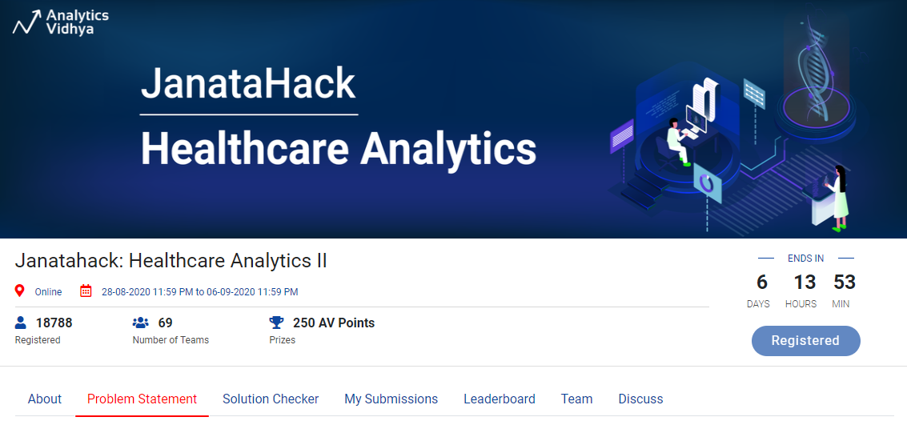

<p align="center">
    
    <br>
    <sup><a href="https://datahack.analyticsvidhya.com/contest/janatahack-healthcare-analytics-ii/" target="_blank">Janatahack-Healthcare-Analytics-II</a></sup>
</p>


# ABOUT 


The healthcare sector has long been an early adopter of and benefited greatly from technological advances. These days, machine learning plays a key role in many health-related realms, including the development of new medical procedures, the handling of patient data, staff management & more.

This weekend we invite you to participate in another Janatahack with the theme of healthcare analytics. Stay tuned for the problem statement and datasets this Friday and get a chance to work on a real healthcare case study along with 250 AV points at stake.


Who should participate?
This hackathon is open for all data enthusiasts: Statisticians, Data scientists, Analysts, and Students


### FAQs

#### 1. Where can I find the dataset and the problem statement for the hackathon?

The contest will go live on the designated contest start date and time. There is a timer that is shown at the top of this page which shows the remaining time before the contest goes live. This is when you can access the problem statement and datasets from the problem statement tab.

 

#### 2. Can I share my approach/code?

Absolutely. You are encouraged to share your approach and code file with the community. There is even a facility at the leaderboard to share the link to your code/solution description.


#### 3. I am facing a technical issue with the platform/have a doubt regarding the problem statement. Where can I get support?

Join the AV slack channel by clicking on 'Join Slack Live Chat' button and ask your query at channel: janata_hack


Recent Covid-19 Pandemic has raised alarms over one of the most overlooked area to focus: Healthcare Management. While healthcare management has various use cases for using data science, patient length of stay is one critical parameter to observe and predict if one wants to improve the efficiency of the healthcare management in a hospital. 

This parameter helps hospitals to identify patients of high LOS risk (patients who will stay longer) at the time of admission. Once identified, patients with high LOS risk can have their treatment plan optimized to miminize LOS and lower the chance of staff/visitor infection. Also, prior knowledge of LOS can aid in logistics such as room and bed allocation planning.

Suppose you have been hired as Data Scientist of HealthMan – a not for profit organization dedicated to manage the functioning of Hospitals in a professional and optimal manner.
The task is to accurately predict the Length of Stay for each patient on case by case basis so that the Hospitals can use this information for optimal resource allocation and better functioning. The length of stay is divided into 11 different classes ranging from 0-10 days to more than 100 days.

 

# Data Description


Train.zip contains 1 csv alongside the data dictionary that contains definitions for each variable

train.csv – File containing features related to patient, hospital and Length of stay on case basis

train_data_dict.csv – File containing the information of the features in train file


Test Set

test.csv – File containing features related to patient, hospital. Need to predict the Length of stay for each case_id


Sample Submission:

case_id: Unique id for each case

Stay: Length of stay for the patient w.r.t each case id in test data


### Evaluation Metric
The evaluation metric for this hackathon is 100*Accuracy Score.


### Public and Private split
The public leaderboard is based on 40% of test data, while final rank would be decided on remaining 60% of test data (which is private leaderboard)

 

### Guidelines for Final Submission
Please ensure that your final submission includes the following:

  ```Solution file containing the predicted Length of stay every case_id in the test set
  Code file for reproducing the submission, note that it is mandatory to submit your code for a valid final submission
  ```
  
  
  
# HACKATHON URL

 https://datahack.analyticsvidhya.com/contest/janatahack-healthcare-analytics-ii/

