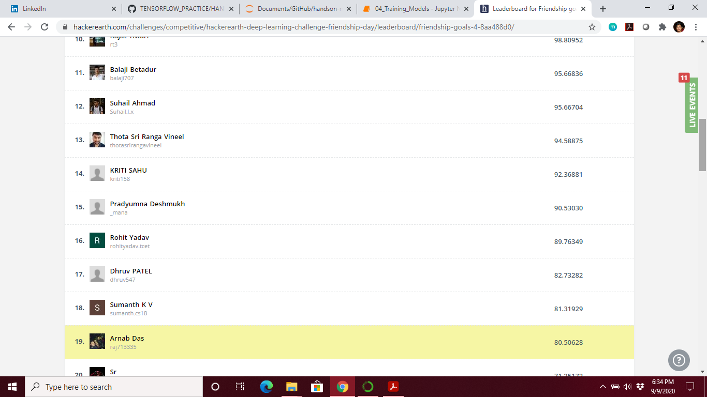

# FRIENDSHIP GOALS 

To celebrate this precious relationship of friendship on the upcoming International Friendship Day, we bring a deep learning challenge to you: #FriendshipGoals. The Anthropology department of an Ivy League school is planning to study the impact of friendship at different life stages. You have been hired as a deep learning specialist to assist their team in this project.

Your task is to build a deep learning model that analyzes an image of a gathering among friends, detects the age group of the gathering, and classifies them into groups of toddlers, teenagers, or adults.

Your task is to build a deep learning model that analyzes an image of a gathering among friends, detects the age group of the gathering, and classifies them into groups of&nbsp;<strong><em>toddlers</em></strong>,&nbsp;<strong><em>teenagers</em></strong>, or&nbsp;<strong><em>adults</em></strong>.

<h2>Data</h2>

<strong>Data description</strong>

You must use an external dataset to train your model. The attached dataset link contains the sample data of each category [Toddler&nbsp;| Teenagers | Adults] and test data.

<strong>Data files</strong>

<table border="1">
	<tbody>
		<tr>
			<td style="text-align:center"><strong>File name</strong></td>
			<td style="text-align:center"><strong>Description</strong></td>
		</tr>
		<tr>
			<td>Test.zip</td>
			<td>Contains image files to be classified</td>
		</tr>
		<tr>
			<td>Sample.zip</td>
			<td>Contains sample image files belonging to each category</td>
		</tr>
		<tr>
			<td>Test.csv</td>
			<td>Predictions file containing indices of test data and a blank target column</td>
		</tr>
		<tr>
			<td>sample_submission.csv</td>
			<td>Submission format that must be followed for uploading predictions</td>
		</tr>
	</tbody>
</table>

<strong>Data description</strong>

<table border="1">
	<tbody>
		<tr>
			<td style="text-align:center"><strong>Column name</strong></td>
			<td style="text-align:center"><strong>Description</strong></td>
		</tr>
		<tr>
			<td>Filename</td>
			<td>File name of test data image</td>
		</tr>
		<tr>
			<td>Category</td>
			<td>Target column [values: 'Toddler'<strong>/</strong>'Teenagers'<strong>/</strong>'Adults']</td>
		</tr>
	</tbody>
</table>

<h2>Submission format</h2>

Please refer to&nbsp;<a href="https://s3-ap-southeast-1.amazonaws.com/he-public-data/Sample%20Submission15b2050.csv" target="_blank">sample_submission.csv</a>&nbsp;for more details

# Evaluation metric
\(score = {100* f1\_score(actual\_values,predicted\_values,average = 'weighted')}\)

## Note: To avoid any discrepancies in the scoring, ensure all the index column (Image) values in the submitted file match the values in the provided test.csv file.

Time Limit:	5.0 sec(s) for each input file.

Memory Limit:	256 MB

Source Limit:	1024 KB

# RESULT (19 out of 5494 TOP 0.0034741%)

    
     
    <a href="https://www.hackerearth.com/challenges/competitive/hackerearth-deep-learning-challenge-friendship-day/problems/">Friendship Goals</a>

19 out of 5494 TOP 0.0034741%

