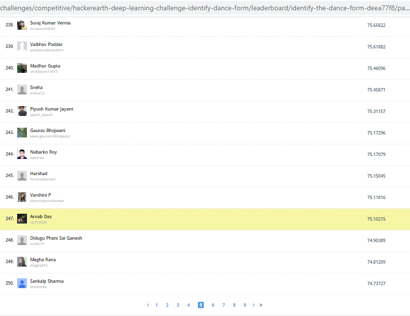

# IDENTIFY_THE_DANCE_FORM_MULTI_CLASS 

A Neural Network Program to train and identify 8 types of dance form from a given set of images.

# Problem statement
This International Dance Day, an event management company organized an evening of Indian classical dance performances to celebrate the rich, eloquent, and elegant art of dance. After the event, the company plans to create a microsite to promote and raise awareness among people about these dance forms. However, identifying them from images is a difficult task.

You are appointed as a Machine Learning Engineer for this project. Your task is to build a deep learning model that can help the company classify these images into eight categories of Indian classical dance.

Note

# The eight categories of Indian classical dance are as follows:

`Manipuri`

`Bharatanatyam`

`Odissi`

`Kathakali`

`Kathak`

`Sattriya`

`Kuchipudi`

`Mohiniyattam`

# Data description

This data set consists of the following two columns:

Column Name	Description

Image	Name of Image

target	Category of Image `['manipuri','bharatanatyam','odissi','kathakali','kathak','sattriya','kuchipudi','mohiniyattam']`

The data folder consists of two folders and two .csv files. The details are as follows:

train: Contains 364 images for 8 classes `['manipuri','bharatanatyam','odissi','kathakali','kathak','sattriya','kuchipudi','mohiniyattam']`

test: Contains 156 images

train.csv: 364 x 2

test.csv: 156 x 1

# Submission format

You are required to write your predictions in a .csv file and upload it by clicking the Upload File button.

# Sample submission

Image,target

96.jpg,manipuri

163.jpg,bharatanatyam

450.jpg,odissi

219.jpg,kathakali

455.jpg,odissi

46.jpg,kathak

# Evaluation metric
\(score = {100* f1\_score(actual\_values,predicted\_values,average = 'weighted')}\)

# Note: To avoid any discrepancies in the scoring, ensure all the index column (Image) values in the submitted file match the values in the provided test.csv file.

Time Limit:	5.0 sec(s) for each input file.

Memory Limit:	256 MB

Source Limit:	1024 KB

# RESULT

    
     
    <a href="https://www.hackerearth.com/challenges/competitive/hackerearth-deep-learning-challenge-identify-dance-form/problems/">Identify The Dance Form</a>

247 out of 5846 TOP 4%

